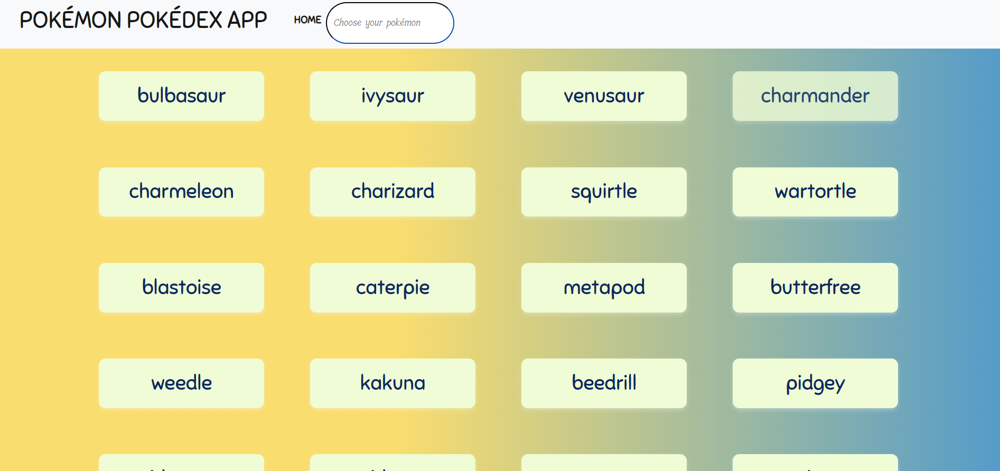
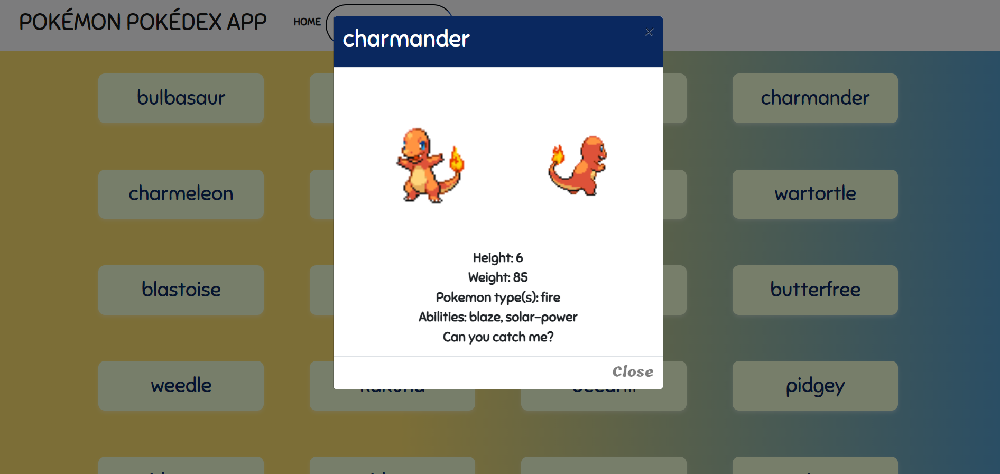

# **Pokédex App**
### A small JavaScript application modeled as a Pokédex, featuring 1,000 Pokémon, each with detailed descriptions fetched from an external API.

## **Table of Content**
- Installation Instructions
- Usage Guide
- Features
- Screenshots
- API Documentation
- Contributing
- License

## **About the Project**
A small javascript appication created using a functional programming approach. modeled as a Pokédex, containing 1000 Pokémon including a description of each Pokémon character fetched from an Application Programming Interface.

## **Features**
- Search Functionality: Easily Search for Pokémon by name.
- Detailed Information: View detailed information for each Pokémon, including a description and stats.

## **Installation**
1. Clone the Repository
First, clone the repository to your local machine using the following command:
`git clone https://github.com/yourusername/pokedex-app.git`
2. Navigate to the Project Directory
`cd pokedex-app`
3. Install Dependencies
This app uses external libraries hosted via CDNs, so there are no additional dependencies to install locally. However, if you plan to make modifications or run the app with a local server, you can use a simple HTTP server. If you have Node.js installed, you can install the `http-server` package:
`npm install -g http-server`
4. Run the App
If using http-server, run the following command to start a local server:
`http-server`
Then, open your web browser and go to:
`http://localhost:8080`

## **Dependencies**
- [This App loads data from pokeAPI](https://pokeapi.co/api/v2/pokemon/?limit=1000)
- bootstrap.min.css
- jquery-3.3.1.slim.min.js
- popper.min.js
- bootstrap.min.js

## **Usage Guide**
- Search for Pokémon using a search bar.
- open a Pokémon card for more details on the desired Pokémon.
- Pokémon cards display a picture of a Pokémon.
- Pokémon cards display a Pokémon height, weight, type, and abilities.

## **Screenshots or Demo**

## **API Documentation**
[An External Pokemon API](https://pokeapi.co/api/v2/pokemon/)

## Contibuting
### Requirements
- Must Load from an External API
- Must display a list of items fetched from an API
- Must contain a view of more details for a given item
- Must use CSS styling
- Must use ESlint rules *May use Prettier*
- Must use at least one complex UI pattern *such as a modal* for details or touch interaction
- Must work in **Chrome, Firefox, Safari, Edge, and Internet Explorer 11**

### How to Contribute
1. Fork the repository.
2. Create a new branch (`git checkout -b feature-branch`).
3. Make your changes and commit them (`git commit -m 'Add new feature'`).
4. Push to the branch (`git push origin feature-branch`).
5. Create a pull request.

## License
This project is licensed under the MIT License - see the LICENSE file for details.